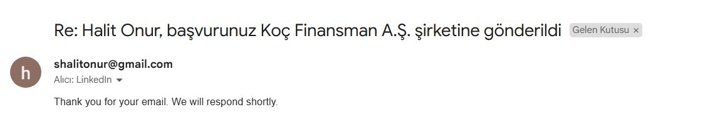
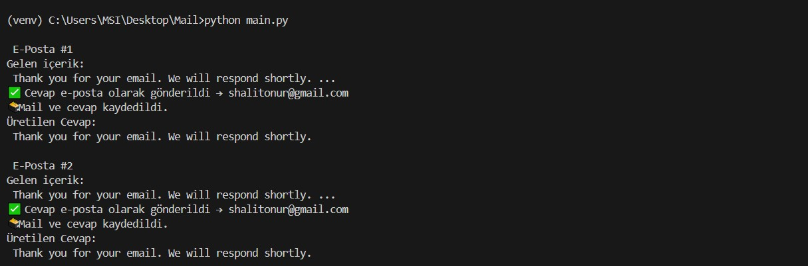

# 🚀 AI-Powered Gmail Auto Responder

An intelligent email management system that automatically processes your Gmail inbox using OpenAI's GPT to generate contextual responses.

## ✨ Key Features

- 📧 Automatic unread email processing
- 🤖 AI-powered response generation using OpenAI GPT
- 🔄 Seamless Gmail API integration
- 📝 Comprehensive interaction logging
- 🔒 Secure authentication handling

## 📸 Screenshots

### Automated Response Example


### Terminal Output Examples



## 🏗️ Project Structure

```
MAIL/
├── credentials.json     # Gmail API credentials
├── token.json          # OAuth authentication token
├── main.py             # Main application orchestrator
├── get_emails.py       # Email fetching module
├── generate_reply.py   # AI response generator
├── send_email_reply.py # Email dispatch handler
├── save_to_file.py     # Logging functionality
└── mail_log.txt        # Activity log file
```

## 🛠️ Technical Requirements

- Python 3.8 or higher
- Google Gmail API access
- OpenAI API key

### Required Dependencies
```bash
pip install -r requirements.txt
```

### Required Gmail API Scopes
- `https://www.googleapis.com/auth/gmail.readonly`
- `https://www.googleapis.com/auth/gmail.send`
- `https://www.googleapis.com/auth/gmail.modify`

## 🚀 Getting Started

1. Enable Gmail API in Google Cloud Console
2. Configure OAuth2 credentials
3. Set up your OpenAI API key
4. Run the application:
```bash
python main.py
```

## 📝 Sample Output
```
📧 Email #1
Incoming Content:
  [Email content here]
📅 Generated Response:
  [AI response here]
📩 Response sent successfully
📂 Interaction logged
```

## ⚠️ Security Notes

- Keep `credentials.json` and OAuth tokens secure
- Never commit API keys to version control
- Store sensitive data in environment variables

## 👤 Author

**Halit Onur Seyitoğlu**
- LinkedIn: [Profile](https://www.linkedin.com/in/halit-onur-seyitoglu-704313277/)

## 📄 License

This project is intended for educational and non-commercial use only. Please contact the author for commercial licensing inquiries.

